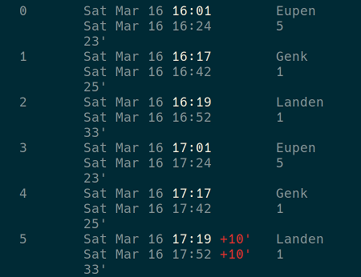

# Ijzerweg

Ijzerweg is a command line program around the [iRail](https://irail.be) routeplanner. iRail has an [API](https://docs.irail.be/) exposing real-time Belgian rail connections meaning you can now find your next train home from the command line (if you live in Belgium 🇧🇪 that is).

## Install

The [binary](https://github.com/cimm/ijzerweg/releases) should work on 64-bit Linux machines. Simply drop the file somewhere in your path.

You can build the program yourself for other architecures. It's a mere `go build ijzerweg.go formatter.go` from the project's root folder.

## Usage

```sh
ijzerweg -from Turnhout -to Kortrijk -time 2019-01-01T10:00:00+01:00
```

Would give you the next five trains from, you guessed it, Turnhout to Kortrijk leaving after 10 AM on the first of January 2019. The date should be RFC3339 formatted, which is a handy trick so you can use the `date` command. I created the following alias which quickly gives me the next 5 trains home. Easy to check if there are no delays before leaving the office.

```bash
alias train='ijzerweg -from Brussels-Central -to Tienen -time $(date -Iseconds)'
```



## What's up with the name?

Ijzerweg is a play on the French "chemin de fer", meaning railroad or, literally, the iron road or "ijzerweg" in Dutch. The correct translation for railroad in Dutch would be "spoorweg"  by the way.

## License

The program is MIT licensed, use it as you see fit. I build it as an exercise in learning Go so any feedback on my code is more than welcome!
